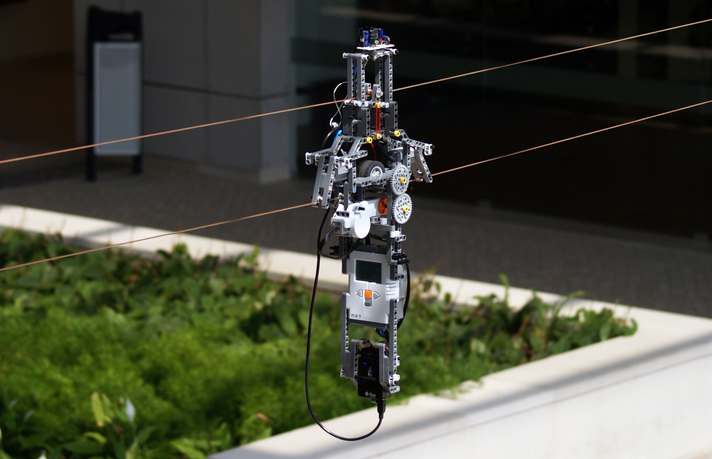

# CHARON: Convergent Hybrid-Replication Approach to Routing in Opportunistic Networks

## Content

Ancient *and* janky research code used for the [CHARON](http://leme.tagus.ist.utl.pt/gems/PmWiki/index.php/Research/CHARONConvergentHybridReplicationApproachToRoutingInOpportunisticNetworks) opportunistic routing algorithm evaluation. Includes both the node and the base station projects. What's cool about it? It ran on Sun Labs' rather obscure [Sun SPOT](https://en.wikipedia.org/wiki/Sun_SPOT) wireless sensor node platform and its bare metal Squawk JVM. 

## CHARON

Wireless Sensor Networks (WSNs) have been slowly moving into the mainstream as remote monitoring solutions – especially in hostile, hard-to-reach or otherwise complicated scenarios, where deployment of a traditional network may be unpractical. Some of the envisioned applications, such as wildlife monitoring, introduce an additional difficulty by featuring mobile elements. In these circumstances traditional routing techniques must be abandoned in favour of Opportunistic Routing (OR), which uses mobility to its advantage by having nodes carry around messages.
This dissertation addresses the issue of Opportunistic Routing in WSNs. An overview of existing solutions is presented, followed by the description of a new Convergent Hybrid-replication Approach to Routing in Opportunistic Networks (CHARON). This approach is focused on simplicity and efficiency, aiming for real-world applicability. It primarily routes messages based on estimated delay, and supports basic Quality of Service (QoS) mechanisms. It also provides built-in radio power management, a seldom found feature. A reference implementation of CHARON is then presented, accompanied by simulation and real-world test results that show this solution is capable of achieving good delivery statistics with high efficiency.

## Related publications
* Jorge M. Soares, Mirko Franceschinis, Rui M. Rocha, Wansheng Zhang and Maurizio A. Spirito, “[Opportunistic Data Collection in Sparse Wireless Sensor Networks](http://dx.doi.org/10.1155/2011/401802)”, in EURASIP Journal on Wireless Communications and Networking, Vol. 2011, Article ID 401802, 20 pages, 2011
* Jorge M. Soares, Wansheng Zhang, Mirko Franceschinis, Maurizio A. Spirito and Rui M. Rocha, “[Experimental and Analytical Performance Evaluation of a Real Opportunistic Wireless Sensor Network](https://ieeexplore.ieee.org/document/5722411)”, in Proceedings of the Future Network & Mobile Summit 2010, Florence, Italy, 2010.
* Jorge M. Soares and Rui M. Rocha, “[CHARON: Routing in Low-Density Opportunistic Wireless Sensor Networks](http://dx.doi.org/10.1109/WD.2009.5449666)”, in Proceedings of the 2nd IFIP Wireless Days, WD 09, Paris, France, 2009.
* Jorge M. Soares, Wansheng Zhang, Mirko Franceschinis, Maurizio A. Spirito, Rui M. Rocha; “Test-bed Implementation For Evaluating And Deploying Heterogeneous Opportunistic WSNs”, NEWCOM++ 2010 Dissemination Day, Florence, Italy, 2010.
* Jorge M. Soares, “[CHARON: Convergent Hybrid-Replication Approach to Routing in Opportunistic Networks – Efficient Collection Routing for Low-Density Mobile WSNs](http://leme.tagus.ist.utl.pt/gems/PmWiki/index.php/Research/CHARONConvergentHybridReplicationApproachToRoutingInOpportunisticNetworks)”, MSc Dissertation, Instituto Superior Técnico – University of Lisbon, 2009.